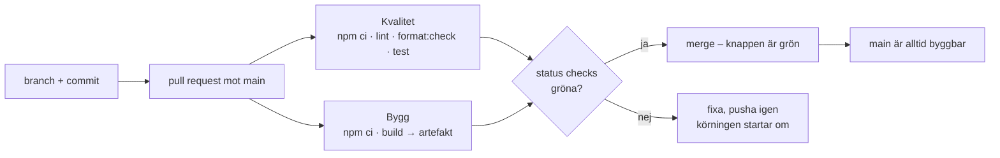

# Pipeline – Utpost

*Exempelifyllt facit (M1). Tider är från en riktig körning på mallrepot – teamen fyller i sina egna.*

## Flödet

## Vad som körs, och varför

| Steg | Kommando | Fångar | Tar |
|---|---|---|---|
| Lint | `npm run lint` (ESLint på `client/`) | oanvända variabler, fel i Vue-templates, `no-undef` | ~4 s |
| Format | `npm run format:check` (Prettier, bara kontroll) | filer som inte kördes genom Prettier – ändrar inget i CI, det gör man lokalt | ~2 s |
| Test | `npm test` (`vitest run`) | ett röktest på guidevyn den här veckan (M1) – riktiga tester i M2 | ~3 s |
| Bygg | `npm run build` (`vite build` av `client/`) | importfel, trasiga templates, allt som bara syns vid bygge | ~2 s |

`npm ci` (~25 s) dominerar – den installerar alla tre workspaces inklusive React-klientens beroenden. När `web/` tas bort (M6) halveras tiden.

## Branch protection (ruleset på `main`)

- Kräver PR – ingen pushar direkt till `main`
- Kräver status checks **Kvalitet** och **Bygg** gröna innan merge
- Kräver att branchen är uppdaterad mot `main` före merge (annars testas en kod som aldrig kommer att finnas)
- Gäller även admins

## Vanliga fel vi sett

- **Grönt lokalt, rött i CI:** `npm run lint` lokalt är samma kommando som i CI. Kör det innan du pushar. Skillnaden brukar vara en fil som inte är sparad, eller `--fix` lokalt som gömde felet.
- **`format:check` rött:** kör `npm run format --workspace=client` och committa. CI ska aldrig ändra kod, bara säga nej.
- **Status check heter fel i rulesetet:** namnet är jobbets `name:` (Kvalitet, Bygg) – inte filnamnet.
